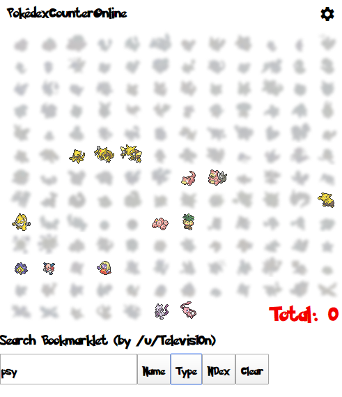

# Pokemon Counter Online - Filtering Bookmarklet

### [Send me to the Bookmarklet](bookmarklet.js)

I know that the Chris and the pokemon speedrunning community have been using the Pokemon Counter Online for a few things. To help out with the normal usage, and the more unique cases, I made a bookmarklet to help filter the chart for a name, a type, or by national dex.

I did this version quite quickly, so I based my type data off of only gen 6. Old Pokemon have their gen 6 types, and beyond gen 6, typing is non-existent. Even with that limitation, the dex number and pokemon name aren't based on my data. Because of that, names and national dex numbers should work regardless of my corner-cutting. (OK, the aloha, and other special forms might have quirks for the dex, but names are fine)

(all following examples are using Gen 1 only)

# Searching By Name

    "b" by Name

returns

    "bulbasaur, blastoise, butterfree, beedrill, arbok, clefable, zubat, golbat, abra, kadabra, bellsprout, weepinbell, victreebel, slowbro, krabby, voltorb, cubone, electabuzz, kabuto, kabutops"

# Searching By Type

    "gra poi" by Type (grass poison)

returns

    "bulbasaur, ivysaur, venusaur, oddish, gloom, vileplume, bellsprout, weepinbell, victreebel"

# Searching By Name & Type

    'b' by Name -> "gra poi" by Type

returns

    "bulbasaur, bellsprout, weepinbell, victreebel"

&#x200B;

# Links

The counter website:  [https://pco.bobchao87.com/](https://pco.bobchao87.com/)

My bookmarklet (file link, this link itself is not the bookmarklet):  [pco-search.min.js](bookmarklet.js)

How to install a bookmarklet:  [https://mreidsma.github.io/bookmarklets/installing.html](https://mreidsma.github.io/bookmarklets/installing.html)

What is a bookmarklet?  [https://www.howtogeek.com/189358/beginner-geek-how-to-use-bookmarklets-on-any-device/](https://www.howtogeek.com/189358/beginner-geek-how-to-use-bookmarklets-on-any-device/)
